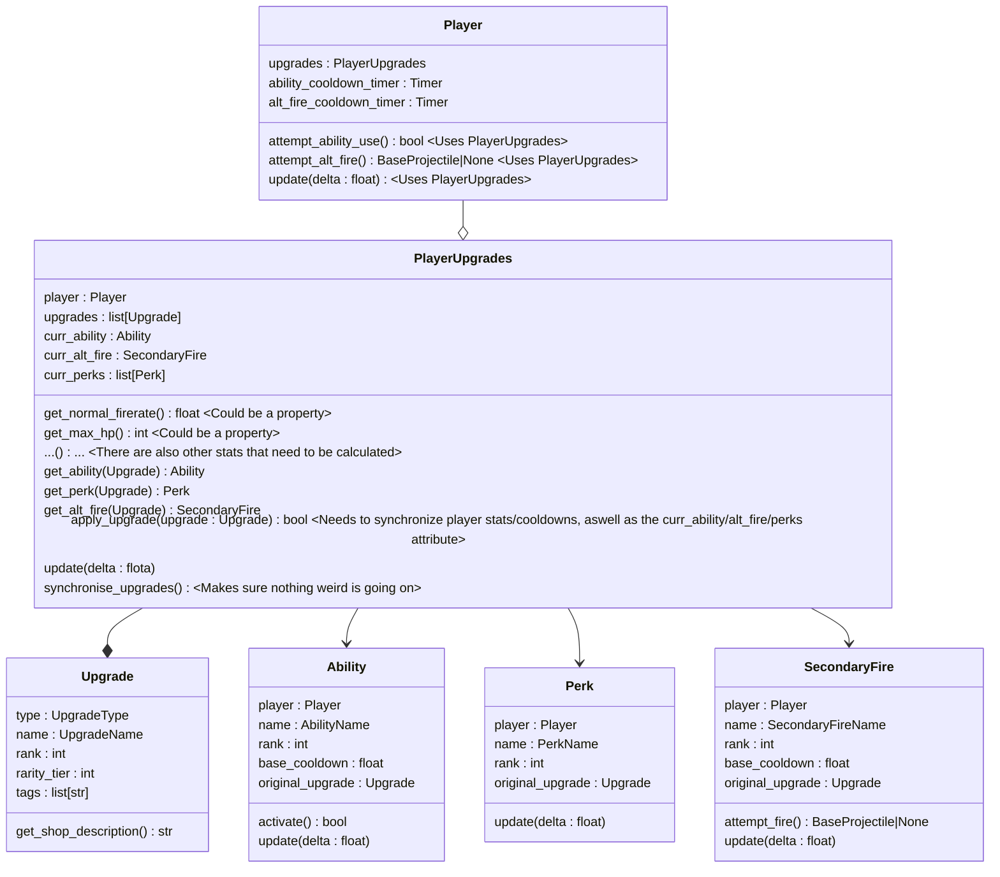

# space-brawl-recode
A recode of my game jam entry Space Brawl (brainless-jam-2026-1)

```mermaid
classDiagram
    class Player {
        upgrades : PlayerUpgrades
        ability_cooldown_timer : Timer
        alt_fire_cooldown_timer : Timer
        attempt_ability_use() bool ~Uses PlayerUpgrades~
        attempt_alt_fire() BaseProjectile|None  ~Uses PlayerUpgrades~
        update(delta : float) ~Uses PlayerUpgrades~
    }

    class PlayerUpgrades {
        player : Player
        upgrades : list[Upgrade]
        curr_ability : Ability
        curr_alt_fire : SecondaryFire
        curr_perks : list[Perk]

        get_normal_firerate() float ~Could be a property~
        get_max_hp() int ~Could be a property~
        ...() ... ~There are also other stats that need to be calculated~
        get_ability(Upgrade) Ability
        get_perk(Upgrade) Perk
        get_alt_fire(Upgrade) SecondaryFire

        apply_upgrade(upgrade : Upgrade) bool ~Needs to synchronize player stats/cooldowns, aswell as the curr_ability/alt_fire/perks attribute~

        update(delta : flota)
        synchronise_upgrades() ~Makes sure nothing weird is going on~
    }
    
    class Upgrade {
        type : UpgradeType
        name : UpgradeName
        rank : int
        rarity_tier : int

        tags : list[str]
        get_shop_description() str
    }

    class Ability {
        player : Player
        name : AbilityName
        rank : int
        base_cooldown : float
        original_upgrade : Upgrade
        activate() bool
        update(delta : float)
    }

    class SecondaryFire {
        player : Player
        name : SecondaryFireName
        rank : int
        base_cooldown : float
        original_upgrade : Upgrade
        attempt_fire() BaseProjectile|None
        update(delta : float)
    }
    
    class Perk {
        player : Player
        name : PerkName
        rank : int
        original_upgrade : Upgrade
        update(delta : float)
    }
    
    Player --o PlayerUpgrades
    PlayerUpgrades --* Upgrade
    PlayerUpgrades --> Ability
    PlayerUpgrades --> Perk
    PlayerUpgrades --> SecondaryFire
```